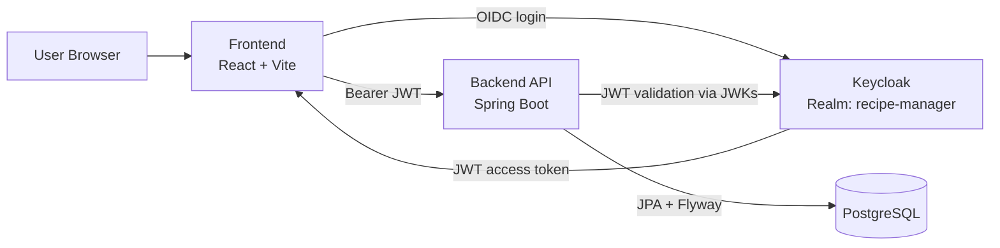

# Recipe Manager

A full-stack demo/reference project for secure recipe management: React frontend, Kotlin/Spring Boot API, PostgreSQL
persistence, and Keycloak-based authentication.

This repository is intentionally structured as a clean monorepo to showcase architecture, security boundaries, and
maintainable engineering practices in a compact example.

## Architecture



## What this project demonstrates

- Secure authentication flow (OIDC/OAuth2 with Keycloak)
- JWT-protected REST API with per-user data isolation
- Clear frontend/backend separation in a monorepo
- Automated checks in CI (lint + build + test)

## Tech Stack

| Layer          | Technology                                                                                   |
|----------------|----------------------------------------------------------------------------------------------|
| Frontend       | React 19, TypeScript, Vite, Material UI, React Query, React Router                           |
| Authentication | Keycloak 24 (realm import + seeded local dev user)                                           |
| Backend        | Kotlin 1.9, Spring Boot 3.5, Spring Security OAuth2 Resource Server, Spring Data JPA, Flyway |
| Database       | PostgreSQL 16                                                                                |
| Testing        | Frontend: Vitest + Testing Library, Backend: JUnit 5 + Kotest + MockK                        |
| CI             | GitHub Actions                                                                               |

## Repository structure

```text
recipe-manager/
├── recipe-manager-frontend/   # React application
├── recipe-manager-backend/    # Spring Boot API + Keycloak realm config + Docker infra
└── .github/workflows/         # CI pipeline
```

## Run locally

### Prerequisites

- Node.js 20+
- npm
- Java 21
- Docker + Docker Compose

### 1. Start infrastructure (PostgreSQL + Keycloak)

```bash
cd recipe-manager-backend
make stack-up
```

### 2. Start backend API

```bash
cd recipe-manager-backend
make start
```

Backend runs on `http://localhost:8080`.

### 3. Start frontend app

```bash
cd recipe-manager-frontend
npm install
npm run dev
```

Frontend runs on `http://localhost:5173`.

The default frontend `.env` already points to local backend and IAM:

- `VITE_API_URL=http://localhost:8080`
- `VITE_IAM_URL=http://localhost:8081`
- `VITE_IAM_REALM=recipe-manager`
- `VITE_IAM_CLIENT_ID=recipe-manager-frontend`

## Deployment possibilities

This project can be deployed either as split services (SPA static hosting + backend API + managed database/Keycloak)
or as a fully containerized stack. If I were deploying it for real, I would start with either AWS-managed services or
Kubernetes, then add OpenTelemetry-based observability (traces, metrics, and logs), dashboards/alerts, and secure
environment-specific configuration and secrets with TLS enabled end to end.

## Module-specific docs

- Backend details: [`recipe-manager-backend/README.md`](./recipe-manager-backend/README.md)
- Frontend details: [`recipe-manager-frontend/README.md`](./recipe-manager-frontend/README.md)

## Future improvements

- [ ] Add OpenAPI documentation.
- [ ] Add Swagger UI for API exploration.
- [ ] Add frontend integration tests (Cypress or Playwright).
